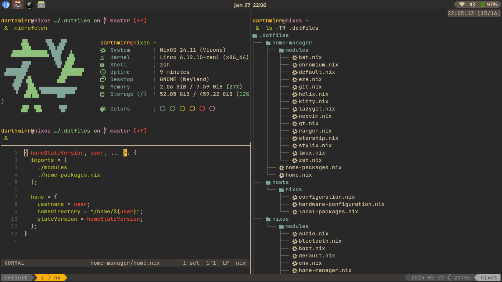

# ❄️ NixOS Config

[](https://nixos.org)


[](./LICENSE)


Welcome to my NixOS configuration built for efficiency and aesthetics. Right now I'm trying to commit something everyday. Let's see how long I can go.



<!--
## File tree

```plaintext
.dotfiles/
├── home-manager/
│   ├── modules/
│   │   ├── bat.nix
│   │   ├── chromium.nix
│   │   ├── default.nix
│   │   ├── eza.nix
│   │   ├── git.nix
│   │   ├── helix.nix
│   │   ├── kitty.nix
│   │   ├── lazygit.nix
│   │   ├── neovim.nix
│   │   ├── qutebrowser.nix
│   │   ├── ranger.nix
│   │   ├── starship.nix
│   │   ├── stylix.nix
│   │   ├── tmux.nix
│   │   ├── zed.nix
│   │   └── zsh.nix
│   ├── home.nix
│   └── home-packages.nix
├── hosts/
│   ├── nixos/
│   │   ├── configuration.nix
│   │   ├── hardware-configuration.nix
│   │   └── local-packages.nix
│   └── wsl/
│       ├── configuration.nix
│       ├── hardware-configuration.nix
│       └── local-packages.nix
├── nixos/
│   └── modules/
│       ├── audio.nix
│       ├── bluetooth.nix
│       ├── boot.nix
│       ├── default.nix
│       ├── env.nix
│       ├── home-manager.nix
│       ├── kernel.nix
│       ├── mime.nix
│       ├── net.nix
│       ├── nh.nix
│       ├── nix.nix
│       ├── timezone.nix
│       ├── user.nix
│       └── zram.nix
├── flake.lock
└── flake.nix
```
-->

## ✨ Features

- 🖥️ **Multiple Hosts Support**: Easy to configure for different hosts.
- 🎨 **Gruvbox Theme**: A perfect blend of vibrant and subtle colors.
- 🪟 **Gnome -- Dash To Panel**: Easy navigation across multiple windows and minimal design
- 🏠 **Home Manager Integration**: lots of stuff configured.
- 🧇 **Tmux**: with my own hotkeys.
- 🌟 **Zsh + starship**: Efficient shell setup with lots of aliases.

## 🚀 Installation

To get started with this setup, follow these steps:

1. **Install NixOS**: If you haven't already installed NixOS, follow the [NixOS Installation Guide](https://nixos.org/manual/nixos/stable/#sec-installation) for detailed instructions.
2. **Clone the Repository**:

   ```bash
   git clone https://github.com/ilosrim/dotfiles ~/.dotfiles
   cd .dotfiles
   ```

3. **Copy one of the hosts configuration to set up your own**:

   ```bash
   cd hosts
   cp -r nixos <your_hostname>
   cd <your_hostname>
   ```

4. **Put your `hardware-configuration.nix` file there**:

   ```bash
   cp /etc/nixos/hardware-configuration.nix ./
   ```

5. **Edit `hosts/<your_hostname>/local-packages.nix` and `nixos/packages.nix` files if needed**:

   ```bash
   vim local-packages.nix
   vim ../../nixos/packages.nix
   ```

6. **Finally, edit the `flake.nix` file**:

   ```diff
   ...
     outputs = { self, nixpkgs, home-manager, ... }@inputs: let
       system = "x86_64-linux";
   --  homeStateVersion = "24.11";
   ++  homeStateVersion = "<your_home_manager_state_version>";
   --  user = "ilosrim";
   ++  user = "<your_username>";
       hosts = [
   --    { hostname = "ilosrim"; stateVersion = "24.11"; }
   ++    { hostname = "<your_hostname>"; stateVersion = "<your_state_version>"; }
       ];
   ...
   ```

7. **Rebuilding**:

   ```bash
   cd .dotfiles
   git add .
   nixos-rebuild switch --flake ./#<hostname>
   # or nixos-install --flake ./#<hostname> if you are installing on a fresh system
   home-manager switch --flake ./#<username>
   ```

## 🫶 Thanks

- [Template](https://github.com/Andrey0189/nixos-config-reborn) - Learned from his configurations

## 🤝 Contributions

Feel free to fork the repository and submit pull requests if you'd like to contribute improvements. Open issues if you encounter any problems with the config or have ideas for new features.
